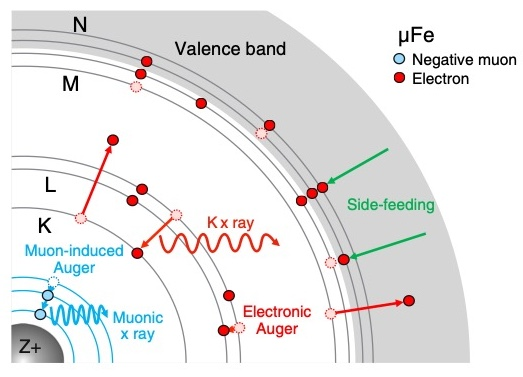
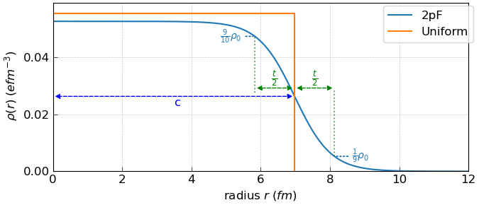

Theory
=======
Prediction of frequencies and probabilities of transition between energy levels of muonic atoms
-------------------------------------------------------------------------------------------------
X-Ray Spectroscopy with negative muons
~~~~~~~~~~~~~~~~~~~~~~~~~~~~~~~~~~~~~~~
While positive muons can be used as magnetic probes acting as if they were light protons, negative muons have wholly different uses due to 
behaving in matter more as if they were heavy electrons. Negative muons possess the same charge and spin as electrons, and so will form 
bound states with nuclei that are known as muonic atoms. These atoms possess peculiar properties due to the heavier mass of the muon:

1. the muon orbitals around the nucleus are much smaller and denser than the electronic ones, meaning that the muon tends to be rather 
   insensitive to the presence of electrons - as it is closer to the nucleus than any of them (See Figure 1);

2. for the same reason, the muon orbitals can overlap significantly with the atomic nucleus, and their energy is affected by the shape 
   of its charge distribution;

3. the muon orbitals have much higher binding energies, which means they can also be treated only with a relativistic theory. In 
   classical terms, you could say the muons are 'orbiting' the nucleus at speeds close to that of light.

Figure 1: Schematic drawing of the muon cascade process and the electron configuration evolution in a muonic iron atom within Fe metal. 
Side feeding and electron refilling, via radiative decay or electronic Auger decay, fill the electron holes. It is assumed that the number 
of 4s electrons is a constant during the cascade because of rapid N-shell side feeding. Figure taken from T. Okumura et. al. 
PHYSICAL REVIEW LETTERS 127, 053001 (2021). 

The consequence of these facts is that when cascading on a nucleus to form a muonic atom, muons will shed their energy in the form of 
highly energetic X-Ray photons, and the specific energies of these photons will be tied to the transitions between levels that are 
unique for each element. For this reason,
`muons can be an excellent probe for non-destructive elemental analysis <https://www.sciencedirect.com/science/article/abs/pii/S0026265X1500301X?via%3Dihub>`_. 
The exact characteristic energies for each element can be tabulated by experimental calibration, but they can also be modelled from first 
principles, by solving the quantum equations to find the orbitals and their energies. However, this is not as simple as applying the usual 
Schrödinger equation, because the muons orbit the nucleus at relativistic energies and the Dirac equation is necessary; plus, at these 
energies, the electrostatic potential itself stops being perfectly Coulombic. For these reasons, we have provided a software that easily 
allows one to perform these calculations by including all necessary details to achieve precision sufficient for the interpretation of 
experiments.

Modelling ground state nuclear properties using muonic x-ray measurements
--------------------------------------------------------------------------

The nuclear charge radius is a fundamental property of the atomic nucleus, and 
its value depends on features of the nuclear structure, such as a nuclear deformation
and nuclear charge distribution. What is considered the nuclear charge radius is the
root mean square (rms) radius, which is defined using the nuclear charge distribution
:math:`\rho` as:

.. math::

 R_{\textrm{rms}}=\sqrt{{\overline{r^{2}}}}= \left[ \frac{ \int r^{2}\rho(r)dr }{\int \rho(r)dr} \right]^\frac{1}{2}

The nuclear charge radius has been systematically measured for almost all stable nuclei, and 
the process involves measuring the x-ray transition energies of corresponding muonic atom.
The binding energy of the muonic atom is sensitive to the charge distribution of the
nucleus and, in principle, the nuclear charge radius can be determined by using the
muonic x-ray measurements. There is a complex relationship between the muonic
x-ray transition energies and the nuclear charge distribution :math:`\rho`. A possible way of
treating this problem is assuming a functional form for :math:`\rho`, such as the 2-parameter
Fermi distribution (2pF):

.. math::
   \rho(r)=\rho_{0} \left[ 1 + \exp\left({4\ln(3)\frac{(r-c)}{t}} \right)  \right]^{-1}

The equation above describes a spherically symmetric nuclear charge distribution that
comprises a uniformly charged spherical nucleus with a 'skin' of thickness *t*, which is
defined as the distance at which the charge density reduces from 90% to 10% of the
density at the centre of the uniformly charged nucleus. The other parameter of the
2pF model is *c*, which describes the half-density radius: the distance from the centre
of the spherical nucleus where the charge density is half of that of the uniform charge
at the centre. Figure (2) below compares the nuclear charge distributions in the uniform
and 2pF models for an example atom 197Au. Using the 2pF model allows for a soft
edge to the nuclear charge density.

Figure 2: Charge density in the spherically symmetric Uniform model and 2pF model for 197Au. 
The uniformly charged nucleus as has a radius described by Ru = 1.2xA:math:`^{\frac{1}{3}}`,
where A is the nucleon number for 197Au. The 2pF model here uses t=2.3 fm and
*c* is annotated to show that it represents the half density radius in the 2pF model.
This happens to coincide with Ru in the Uniform model but this is generally not the
case. The 2pF model does not have a hard edge like the uniform model. Instead, the
edge is diffuse and :math:`\rho` falls from :math:`\frac{9}{10}` :math:`\rho_{0}` to 
:math:`\frac{1}{10}` :math:`\rho_{0}` across distance *t* around *r* = c as shown
by the annotations in Figure (2).

MuDirac can automatically define the parameters of the 2pF model. If no values are
explicitly defined, MuDirac uses t=2.3 fm, while
*c* is obtained from nuclear data tables. Hence, the *c* and *t* parameters of the 2pF
model can be defined *a priori*. This is because the initial focus of MuDirac was the
calculation of muonic x-ray transition energies for elemental analysis. However,
there has been a growing need in the negative muon community, working on nuclear
physics, for software tools that can be used to estimate the 2pF model's *c* and *t*
parameters from experimental muonic x-ray measurements. Hence, MuDirac has been adapted 
so that it can reverse-engineer the Dirac equation to efficiently obtain the 2pF model
parameters *c* and *t* using, at least, two experimentally measured muonic x-ray transition energies.